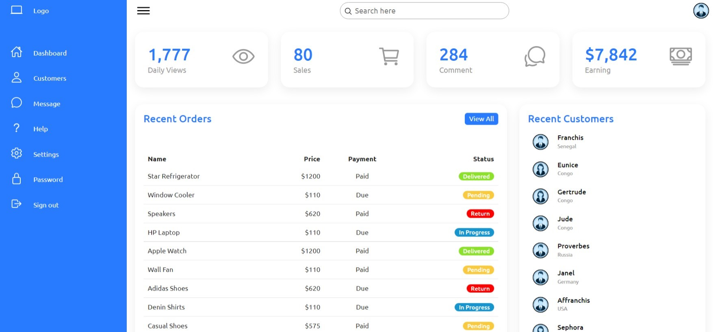

<html>
    <head>
        <link rel="stylesheet" href="https://cdn.jsdelivr.net/npm/bootstrap@5.1.3/dist/css/bootstrap.min.css">
    </head>
    <body>
        

            <h1 class="text-center text-primary display-1">Dashboard</h1>
            <h2 class="display-5">About dashboard</h2>
            
Responsive Admin Dashboard

            <h2 class="display-5">Illustrations</h2>
            

                <h3>Desktop</h3>
                
            

            

                <h3>Tablet</h3>
                
            

            

                <h3>Phone</h3>
                
            

        

    </body>
</html>